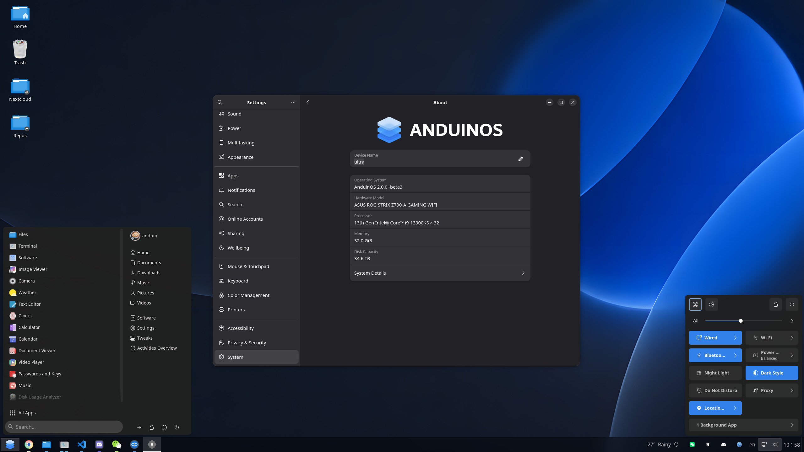

# Andiora OS 🚀

[](https://github.com/AiursoftWeb/AnduinOS-2/blob/master/LICENSE)
[](https://github.com/Anduin2017/AnduinOS/discussions)
[](https://www.anduinos.com/)


> **Elegance in Simplicity, Power in Every Byte.**

Andiora is a minimalist, modern, and high-performance operating system designed with a focus on clean aesthetics and a smooth user experience. It offers a familiar, lightweight, and distraction-free environment built to deliver a premium feel with seamless execution.

[Download Andiora](https://www.anduinos.com/)



## ✨ Features

* **Minimalist UI/UX:** Clean typography, geometric design elements, and a distraction-free interface.
* **Lightweight & Fast:** Optimized resource management for smooth performance across systems.
* **Modern Aesthetic:** Deep purple/lilac gradient integration with a refined visual hierarchy.

## 🛠️ How to build

It is suggested to use Andiora to build Andiora.

To build the OS, run the following command:

```bash
make